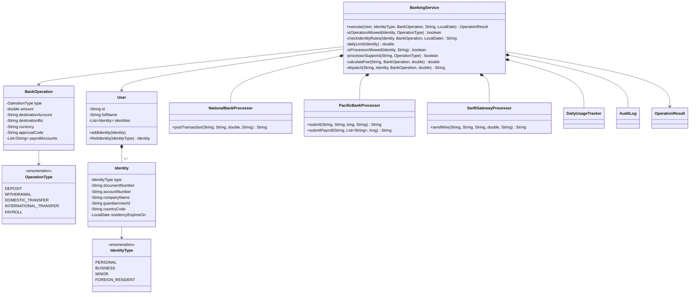

## Problem 4: Multi-Identity Banking with Processors

### 4.1 Description

A banking platform serves users who can hold **K types of identity** at the same time. One person might be a private individual *and* the legal representative of a company. Another might be a minor whose parent is their guardian. The identity used for an operation determines what the user may do, how much they can move per day, and which extra rules apply.

Operations are carried out through **processors**, which are external banks and payment networks. There are several of them, and each has its own API, its own fees, and its own way of reporting failures.

**Identities**

| Identity | Documents | Allowed operations | Daily limit (outgoing) | Extra rules |
|----------|-----------|--------------------|------------------------|-------------|
| Personal | National ID | Deposit, withdrawal, domestic transfer | 2,000 | — |
| Business | Tax ID + company name | All, including international transfer and payroll | 50,000 | Operations above 10,000 need an approval code |
| Minor | National ID + guardian | Deposit, withdrawal | 100 | Must have a guardian; National Bank only |
| Foreign resident | Passport + country + residency expiry date | All except payroll | 5,000 | Blocked once the residency permit has expired |

**Processors**

| Processor | Operations | Fee | API style |
|-----------|------------|-----|-----------|
| National Bank | Deposit, withdrawal, domestic transfer | Free | `postTransaction(...)` returns a reference, or `null` if rejected |
| Pacific Bank | Domestic transfer, payroll | 0.5% | Amounts in **cents**; returns `"REJECTED:<reason>"` on failure |
| SWIFT gateway | International transfer | 25 flat + 1% if not USD | **Throws an exception** on invalid data |

A payroll pays the same amount to each employee on the list, so its total is that amount × the number of employees. Deposits do not count against the daily limit.

### 4.2 Design without inheritance or polymorphism

`Identity` is a single class with a type code, holding the fields that *any* identity type might need. The processors are three unrelated classes, because each one mirrors a different external API. A single `BankingService` coordinates everything. It finds the identity, checks the permissions, identity rules, and limits, picks the processor, calculates the fee, calls the processor with that processor's own method signature, turns each processor's failure style into a result, and writes the audit trail.

### SPEC

#### Class diagram

// Arreglar código spaghetti y acoplamiento de la clase BankingService, y explicar solución:

### SPEC
class Identity {
    -IdentityType type
    -String documentNumber
    -String accountNumber
    -String companyName
    -String guardianUserId
    -String countryCode
    -LocalDate residencyExpiresOn
}

class BankOperation {
    -OperationType type
    -double amount
    -String destinationAccount
    -String destinationBic
    -String currency
    -String approvalCode
    -List~String~ payrollAccounts
}